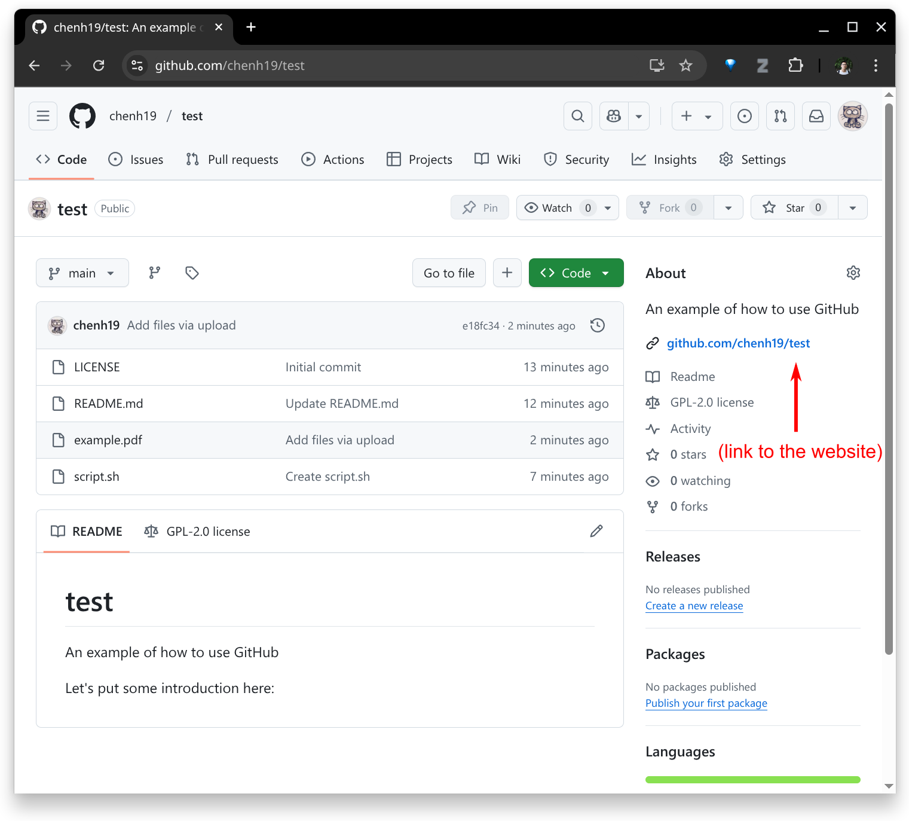

### 1. Sign up to GitHub

- If you haven't, you may sign up to GitHub [here](https://github.com/signup).

<div style="text-align:center;"></div>

- If you never had any exposure to **Markdown**, it's just text file with some symbols that can be read by other software. It's very simple to learn. The [basic syntax](https://www.markdownguide.org/cheat-sheet/#basic-syntax) will cover the majority of the usage case.

### 2. Create a new repository

- Now you need to create a new repository. There is nothing fancy with a "repository", you may just consider it as a "folder".

<div style="text-align:center;"></div>
<div style="text-align:center;"></div>
<div style="text-align:center;"></div>

### 3. Edit the README.md file

<div style="text-align:center;"></div>
<div style="text-align:center;"></div>
<div style="text-align:center;"></div>
<div style="text-align:center;"></div>

### 4. Create a new file

<div style="text-align:center;"></div>
<div style="text-align:center;"></div>
<div style="text-align:center;"></div>
<div style="text-align:center;"></div>

### 5. Upload files

<div style="text-align:center;"></div>
<div style="text-align:center;"></div>
<div style="text-align:center;"></div>

### 6. Add link to your website

refer to Quarto repo

<div style="text-align:center;"></div>
<div style="text-align:center;"></div>
<div style="text-align:center;"></div>

### 7. Create a release

<div style="text-align:center;"></div>
<div style="text-align:center;"></div>
<div style="text-align:center;"></div>
<div style="text-align:center;"></div>
<div style="text-align:center;"></div>

### 8. Using command line

<div style="text-align:center;"></div>

<details>
<summary>**Note:**</summary>
<div style="font-size: 0.9em">

</div>
</details>

### 9. Repository settings

<div style="text-align:center;"></div>
<div style="text-align:center;"></div>

Assume you have created a repository (refer to step 2)

setup git_ssh using


- Create a folder (replace ```test``` with your desired folder name):
```
mkdir -p ./test/ && cd ./test/
```

- Initialize the folder (replace ```git@github.com:chenh19/test.git``` with your SSH URL):
```
git init && git remote add origin git@github.com:chenh19/test.git
```

- Pull your repository (replace ```git@github.com:chenh19/test.git``` with your SSH URL):
```
git pull git@github.com:chenh19/test.git
```

- Create or edit your files locally.

- Push to your repository:
```
git add --all && git commit -a -m "update" && git push -u origin main
```
